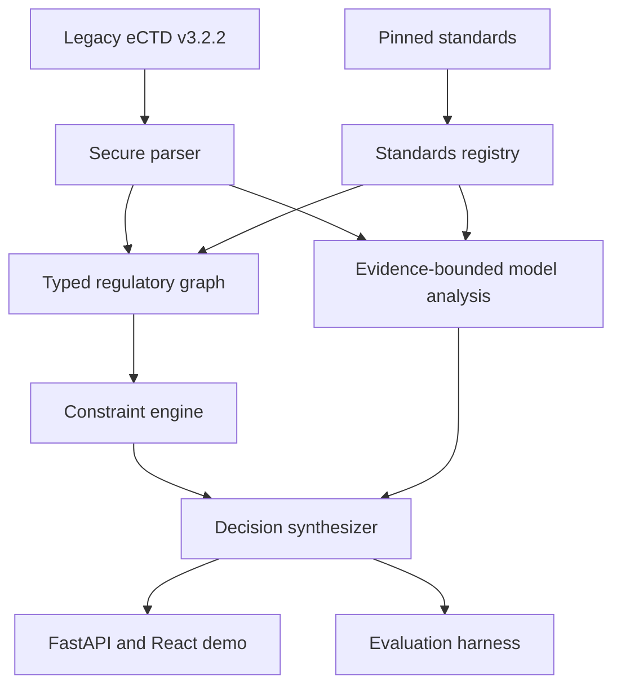

# RegBridge Implementation Specification

This document translates the RegBridge research idea into an implementation and evaluation plan for Codex. It is linked from [AGENTS.md](./AGENTS.md), whose instructions govern work in this repository.

## 1. Product statement

RegBridge is an FDA/CDER-scoped research prototype that analyzes whether content from an eCTD v3.2.2 submission should be reused in a selected eCTD v4.0 context.

Existing submission tooling can determine whether a file or lifecycle reference is syntactically possible. RegBridge focuses on the next decision: whether reuse is structurally, contextually, and evidentially defensible under the selected standards snapshot. It combines:

1. deterministic parsing of the legacy package;
2. a reviewed, version-aware regulatory knowledge graph;
3. executable constraints for explicit structural and metadata requirements;
4. evidence-bounded model analysis for ambiguous content risk;
5. a traceable decision, minimal repair, and human-review boundary.

The MVP is a decision-support demonstrator, not a submission builder or acceptance predictor.

## 2. Research hypothesis

The primary hypothesis is:

> A hybrid system using a typed, version-aware regulatory graph and executable constraints will reduce unsafe false negatives and improve evidence-grounded explanations compared with a long-context agent, flat retrieval agent, and rule-only system.

The intended contribution is not merely ontology construction. It is the representation and enforcement of **versioned applicability**: which standard, rule, heading, keyword, and evidence applies to a legacy artifact in a particular target context and what action follows.

## 3. Why a graph is useful

A conventional document index can retrieve passages about headings, validation rules, or keywords. It does not naturally express that a rule:

- comes from a particular standard version;
- applies only to a given authority, center, application type, or date range;
- requires or prohibits a particular relation;
- supersedes another rule;
- is supported by a specific evidence span;
- triggers a repair only under a specific reuse context.

The graph therefore represents the regulatory objects and their qualified relationships. Executable constraints evaluate those objects. The language model is reserved for interpretations that are genuinely semantic rather than exact joins or comparisons.

Wikontic may be used as **methodological inspiration**, especially for candidate triple extraction, ontology domain/range validation, entity normalization, deduplication, and graph inspection. Do not copy its Wikidata-centered architecture wholesale. RegBridge requires stronger provenance, temporal and jurisdictional qualifiers, deontic rule semantics, review states, and an executable rule layer. If source code is reused, verify its license, preserve required attribution, isolate the adapted component, and document the architectural difference.

## 4. System boundary

### Inputs

- a controlled legacy eCTD v3.2.2 fixture or uploaded ZIP/directory;
- `index.xml`, `us-regional.xml`, optional `stf.xml`, and referenced files within the allowed fixture profile;
- an explicit target context containing target standard version, FDA center, application type, analysis date, and intended reuse operation;
- a pinned, reviewed standards snapshot;
- optional live OpenAI-compatible model configuration.

### Outputs

- normalized inventory of legacy leaves and referenced files;
- target-context compatibility findings;
- one allowed reuse decision per analyzed artifact;
- severity, confidence, and abstention state;
- triggered rules and complete evidence provenance;
- minimum repair or human-review recommendation;
- graph neighborhood and reasoning trace suitable for UI inspection;
- machine-readable records for benchmark evaluation and paper tables.

### Trust boundary

Uploaded packages and model responses are untrusted. Standards snapshots and rule definitions become trusted only after schema validation and explicit review status. A graph edge is not authoritative merely because an extraction model produced it.

## 5. Proposed architecture



### Architectural rules

- Use a modular monolith for the MVP. Do not introduce microservices.
- Use in-process typed domain objects and a `networkx.MultiDiGraph`-compatible graph abstraction.
- Persist canonical records in SQLite plus JSON artifacts. The graph can be rebuilt deterministically; it is not the sole persistence layer.
- Use Pydantic models for service boundaries and JSON Schema exports for fixtures, rules, and model outputs.
- Keep standards ingestion, dossier parsing, graph construction, rule execution, model assistance, decision synthesis, baselines, and evaluation in separate modules.
- The React client consumes versioned JSON APIs. It must not contain regulatory decision logic.

## 6. Repository layout

Use this target structure unless an existing repository convention makes a small change clearly preferable:

```text
.
├── AGENTS.md
├── IMPLEMENTATION.md
├── README.md
├── Makefile
├── .env.example
├── backend/
│   ├── pyproject.toml
│   ├── app/
│   │   ├── main.py
│   │   ├── config.py
│   │   ├── api/
│   │   ├── domain/
│   │   ├── parsers/
│   │   ├── standards/
│   │   ├── graph/
│   │   ├── rules/
│   │   ├── llm/
│   │   ├── analyzer/
│   │   ├── baselines/
│   │   └── evaluation/
│   └── tests/
│       ├── unit/
│       ├── integration/
│       ├── security/
│       └── fixtures/
├── frontend/
│   ├── package.json
│   ├── vite.config.ts
│   └── src/
│       ├── api/
│       ├── components/
│       ├── features/
│       ├── pages/
│       ├── styles/
│       └── test/
├── data/
│   ├── standards/
│   │   ├── manifest.yaml
│   │   └── snapshots/
│   ├── demo-cases/
│   └── benchmark/
├── schemas/
├── scripts/
├── results/
│   └── .gitkeep
└── paper/
    ├── figures/
    └── tables/
```

Generated results should be separated from reviewed benchmark labels. Commit only small canonical result snapshots needed for reproducibility; do not commit secrets, caches, uploaded user files, or large model traces.

## 7. Domain model

### 7.1 Target context

At minimum:

```json
{
  "authority": "FDA",
  "center": "CDER",
  "application_type": "NDA",
  "source_standard": "eCTD-3.2.2",
  "target_standard": "eCTD-4.0",
  "analysis_date": "2026-08-29",
  "reuse_operation": "reference-existing-content",
  "standards_snapshot_id": "fda-cder-demo-v1"
}
```

`application_type` must be explicit even if the first fixtures cover only one or two types. Out-of-scope values must trigger a scoped abstention rather than reuse of a nearby rule.

### 7.2 Core graph node types

| Node | Purpose |
|---|---|
| `StandardDocument` | An official FDA or ICH publication or technical artifact. |
| `StandardVersion` | A version/effective state of a standard. |
| `Rule` | A normalized requirement, prohibition, recommendation, or validation rule. |
| `EvidenceSpan` | The exact section, page, table row, XML node, or quoted span supporting a fact. |
| `RegulatoryAuthority` | FDA, with CDER captured in applicability context. |
| `ApplicationContext` | Authority, center, application type, dates, standards, and operation. |
| `CTDHeading` | A heading identifier and its availability in a standard version. |
| `KeywordDefinition` | A controlled metadata name/value and applicable definition. |
| `ValidationCriterion` | A criterion identifier, severity, condition, and expected result. |
| `LegacyLeaf` | A parsed v3.2.2 lifecycle leaf. |
| `DossierDocument` | A referenced PDF or other allowed dossier file. |
| `ReuseDecision` | The synthesized decision record. |
| `RepairAction` | The smallest supported change or escalation. |

### 7.3 Core edge types

`VERSION_OF`, `SUPERSEDES`, `APPLIES_TO`, `DEFINED_BY`, `SUPPORTED_BY`, `LOCATED_UNDER`, `AVAILABLE_IN`, `REMOVED_IN`, `MAPS_TO`, `HAS_KEYWORD`, `REFERENCES_DOCUMENT`, `REPLACES`, `CONFLICTS_WITH`, `REQUIRES`, `PROHIBITS`, `RECOMMENDS`, `TRIGGERS_DECISION`, and `REQUIRES_REPAIR`.

Every node and edge has a stable identifier and type. Regulatory graph assertions also carry:

- authority and jurisdiction;
- FDA center and application-type scope;
- source and target standard versions;
- valid-from and valid-to values when known;
- source document, version, and locator;
- bindingness and severity;
- extraction method (`manual`, `deterministic`, or `model_candidate`);
- review status (`candidate`, `reviewed`, `authoritative_for_demo`, or `rejected`);
- confidence for probabilistic assertions;
- exact evidence-span identifier.

Only reviewed assertions may support deterministic demo conclusions. `authoritative_for_demo` means reviewed for the frozen research snapshot, not generally authoritative regulatory advice.

### 7.4 Parsed legacy leaf

Capture at least:

- leaf ID and lifecycle operation;
- source XML path and node locator;
- referenced file path and checksum;
- CTD heading path;
- title and relevant regional metadata;
- keywords/attributes needed by scoped rules;
- replacement/reference relationships;
- parse warnings;
- extracted text spans and hyperlink targets when the file profile allows them.

Preserve raw values alongside normalized values. Never discard a source value merely because normalization failed.

## 8. Standards registry and graph formation

### 8.1 Frozen source manifest

`data/standards/manifest.yaml` is the standards source of truth. Each entry must include:

```yaml
id: stable-source-id
title: Human-readable title
authority: FDA
center: CDER
version: explicit-version-or-date
source_url: https://...
retrieved_at: 2026-08-29T00:00:00Z
local_path: snapshots/example.pdf
sha256: ...
bindingness: requirement
scope:
  application_types: [NDA]
  source_standards: [eCTD-3.2.2]
  target_standards: [eCTD-4.0]
review_status: reviewed
notes: ...
```

The initial registry should include only official materials necessary to support the three cases and the eCTD structural parser. Maintain a human-readable source ledger that maps each executable rule to its exact source locator.

### 8.2 Formation pipeline

1. Register and hash the official source snapshot.
2. Segment it into stable evidence spans with source locators.
3. Extract candidate entities and relations deterministically where tables/XML permit it.
4. Optionally use a model to propose triples from prose.
5. Validate candidate triples against allowed node types, edge types, domain/range, qualifiers, and evidence requirements.
6. Normalize identifiers and deduplicate without merging different versions or scopes.
7. Require explicit review before a candidate can support a deterministic rule.
8. Build the graph and run integrity checks.
9. Export a frozen graph snapshot and build manifest for evaluations.

Borrow the useful discipline of ontology-aware extraction from Wikontic, but add regulatory-specific validation:

- no assertion without an evidence span;
- no rule without version and applicability qualifiers;
- no silent merge across standard versions;
- no `REQUIRES` or `PROHIBITS` edge inferred solely from weak language;
- no candidate edge treated as enforceable before review.

### 8.3 Graph integrity checks

Fail the build when:

- a rule lacks evidence or scope;
- an evidence span points to an unknown source digest;
- an edge violates its domain or range;
- a heading availability assertion has no standard version;
- two reviewed assertions conflict at the same scope without an explicit conflict record;
- a decision-triggering rule points to an unknown decision or repair;
- identifiers are unstable across two builds from identical inputs.

## 9. Rule and constraint engine

Represent rules as versioned data validated by Pydantic and exported as JSON Schema. Python evaluators may implement predicates, but the regulatory statement, applicability, evidence, severity, and action must remain visible in data.

Example shape:

```yaml
id: FDA-DEMO-HEADING-001
title: Target heading unavailable
bindingness: requirement
applies_when:
  authority: FDA
  center: CDER
  source_standard: eCTD-3.2.2
  target_standard: eCTD-4.0
predicate:
  type: target_heading_unavailable
severity: blocking
decision: BREAK_LIFECYCLE_AND_RESUBMIT
repair: relocate_to_nearest_available_parent
evidence_ids: [evidence-heading-map-001]
review_status: authoritative_for_demo
```

### Rule precedence

Use a deterministic, tested precedence policy:

1. explicit prohibition or unrecoverable target conflict → `DO_NOT_REUSE`;
2. lifecycle-breaking structural requirement → `BREAK_LIFECYCLE_AND_RESUBMIT`;
3. repairable exact metadata conflict → `REUSE_AFTER_METADATA_REPAIR`;
4. new contextual material needed but original may remain → `REUSE_WITH_NEW_CONTEXT`;
5. no material finding and sufficient evidence → `REUSE_AS_LEGACY_REFERENCE`;
6. missing, contradictory, low-confidence, or out-of-scope evidence → `HUMAN_REGULATORY_REVIEW`.

This is not a simple numeric maximum. A semantic model finding may escalate a permissive result to human review or a stricter supported outcome, but it cannot reduce the severity of a deterministic finding. Multiple triggered rules must all remain visible even when one controls the primary decision.

Use severities `informational`, `low`, `medium`, `high`, `blocking`, and `unresolved`. Keep severity distinct from the decision label.

## 10. Model abstraction

### 10.1 Interface

Define a small provider-neutral interface such as:

```python
class StructuredModel(Protocol):
    async def complete(self, request: ModelRequest, output_type: type[T]) -> T: ...
```

Required implementations:

- `OpenAICompatibleModel`: configurable base URL, model name, API key, timeout, retry policy, and structured JSON response handling;
- `FixtureModel`: returns deterministic, versioned responses keyed by fixture ID;
- optionally `DisabledModel`: produces a typed abstention for rule-only runs.

Recommended environment contract:

```text
LLM_MODE=fixture|live|disabled
LLM_BASE_URL=
LLM_API_KEY=
LLM_MODEL=
LLM_TIMEOUT_SECONDS=60
```

Tests and the default demo must use `fixture`. The live path must be opt-in and must not change benchmark gold data.

### 10.2 Prompt and output constraints

- Supply only evidence spans and structured context relevant to the task.
- Give each span a stable identifier.
- Require citation of one or more supplied evidence identifiers for every substantive finding.
- Use temperature zero or the nearest supported deterministic setting for evaluation.
- Reject unknown labels, uncited claims, malformed JSON, and citations to absent evidence.
- Record prompt-template version, model configuration, token usage, latency, and validation errors.
- Do not log API keys or entire uploaded documents.
- Retry transport failures only; do not repeatedly prompt until a desired classification appears.

The semantic-risk output should distinguish direct observation from inference and include `abstain_reason`.

## 11. Analyzer pipeline

For each selected legacy leaf:

1. validate the target context and standards snapshot;
2. load the parsed leaf, file metadata, relevant text, and hyperlinks;
3. query the graph for heading, keyword, validation, lifecycle, and evidence relationships applicable to the exact context;
4. execute deterministic rules;
5. construct a minimal evidence packet for semantic analysis;
6. validate the model response and discard unsupported findings;
7. synthesize the final decision using precedence and abstention policy;
8. generate a minimal repair from reviewed rule actions, not free-form speculation;
9. persist a complete trace and return a redacted API representation;
10. expose the relevant graph neighborhood for explanation.

The same analyzer path must run the three demo archetypes and their variants. Case IDs may select inputs, but no branch may select a predetermined decision.

## 12. Demonstration cases and benchmark

Create approximately 30 controlled cases: ten variants per archetype. The exact number may change slightly if the user approves, but every archetype must contain:

- positive/high-risk examples;
- clean negative examples;
- ambiguous examples that should abstain;
- perturbations that prevent matching on a single keyword or file name.

### Case A — unavailable heading

Variants should change leaf titles, file names, sibling placement, and target mapping while preserving or removing the actual heading conflict. Include a case where the heading remains valid so the analyzer does not over-trigger.

### Case B — legacy metadata tension

Variants should distinguish an existing legacy reference from creation of a new target artifact. Include exact matching, missing values, discouraged values, and an out-of-scope keyword. The gold rationale must explicitly state why lifecycle context changes the recommendation.

### Case C — stale content or hyperlink

Use small synthetic PDFs with controlled text and link annotations. Vary obsolete headings, applicant names, internal destinations, and benign historical statements. Include subtle and ambiguous language requiring human review.

### Benchmark record

Each benchmark item should contain:

```json
{
  "case_id": "case-a-001",
  "archetype": "unavailable-heading",
  "input_fixture": "...",
  "target_context_id": "...",
  "gold_decision": "BREAK_LIFECYCLE_AND_RESUBMIT",
  "gold_severity": "blocking",
  "required_rule_ids": ["FDA-DEMO-HEADING-001"],
  "acceptable_evidence_ids": ["evidence-heading-map-001"],
  "required_repair_type": "relocate_to_nearest_available_parent",
  "human_review_required": false,
  "rationale": "...",
  "split": "test",
  "provenance": "synthetic-mutation-spec-v1"
}
```

Freeze train/development/test partitions before final experiments. If examples are used for prompt development, they cannot remain hidden test cases.

## 13. Baselines

All systems use the same source snapshot, case inputs, labels, and evaluation harness.

### B0 — long-context document agent

Provide the target context, legacy artifact, and the relevant standards corpus directly in one model context up to a declared deterministic limit. No graph queries or programmatic constraints. Require the same structured decision schema and evidence identifiers.

This is the minimum baseline specifically requested by the research plan.

### B1 — flat retrieval agent

Chunk the same standards snapshot and retrieve top-k spans using a fixed, reproducible retrieval method. A local BM25 or TF-IDF implementation is acceptable for the first complete run; if embeddings are later added, keep the lexical result as a named baseline. Do not traverse typed graph edges or execute constraints.

### B2 — rule-only analyzer

Run the same parser, graph facts, and deterministic constraints as RegBridge but disable semantic model analysis. This isolates the value of the semantic component, especially for stale content.

### Proposed — RegBridge

Run the complete graph, constraint, and evidence-bounded semantic pipeline.

For model-based systems, hold model, decoding parameters, schema, and maximum relevant context as constant as practical. Report unavoidable differences. Cache immutable live-model responses by request digest for auditability, while keeping secrets and licensed full text out of committed artifacts.

## 14. Evaluation

### 14.1 Primary metrics

- **Unsafe false-negative rate:** fraction of gold high-risk/blocking cases predicted as safe reuse. This is the primary safety metric.
- **High-risk recall:** recall for cases requiring lifecycle break, non-reuse, or human review due to material uncertainty.
- **Macro-F1:** balanced performance across the six decision labels.

### 14.2 Supporting metrics

- decision accuracy;
- heading mapping accuracy;
- evidence citation precision/recall and citation validity;
- repair-action exact or adjudicated accuracy;
- human-review/abstention precision and recall;
- calibration, using Brier score or expected calibration error when probabilities are meaningful;
- median and p95 latency;
- model requests, input/output tokens, and estimated cost when available;
- graph build time and analyzer runtime.

### 14.3 Reproducibility record

Every evaluation run writes a manifest containing:

- git commit or source-tree digest;
- timestamp, random seed, and run ID;
- benchmark and standards snapshot digests;
- graph and rule-set versions;
- system and baseline configuration;
- model provider-neutral configuration without secrets;
- prompt-template versions;
- per-case outputs, validation errors, timings, and aggregate metrics.

Generate Markdown/CSV/JSON tables under `results/` and paper-ready tables under `paper/tables/`. Claims in the paper must be traceable to a run manifest.

## 15. API specification

Use a versioned prefix such as `/api/v1`. Minimum endpoints:

| Method and path | Purpose |
|---|---|
| `GET /health` | Process health and dependency status without secrets. |
| `GET /api/v1/config/scope` | Supported authority, center, standards, cases, and disclaimer. |
| `GET /api/v1/standards/snapshots` | Frozen snapshot metadata and review state. |
| `POST /api/v1/applications/parse` | Securely parse an allowed fixture/upload and return an inventory. |
| `POST /api/v1/analyses` | Start or perform an analysis for a leaf and target context. |
| `GET /api/v1/analyses/{id}` | Return decision, findings, evidence, repair, and uncertainty. |
| `GET /api/v1/analyses/{id}/graph` | Return a bounded explanatory subgraph. |
| `POST /api/v1/baselines/run` | Run a named baseline for authorized demo data. |
| `POST /api/v1/evaluations` | Run a benchmark configuration. |
| `GET /api/v1/evaluations/{id}` | Return status, manifest, metrics, and per-case links. |

Long evaluations may run as in-process background jobs for the MVP, but job state must be explicit. Limit concurrency and do not expose arbitrary filesystem paths or shell commands.

Generate and commit the OpenAPI schema as a reviewable artifact. Frontend API types should be generated from or checked against it.

## 16. Frontend specification

Use React, TypeScript, Vite, Tailwind CSS, Iconoir, React Router, and TanStack Query. Use React Flow for the bounded explanation graph unless an early spike demonstrates a material accessibility or layout problem.

### Required views

1. **Project and scope overview** — one-sentence research question, FDA/CDER scope, standards snapshot, research disclaimer, and fixture/upload entry point.
2. **Application inventory** — parsed leaves, headings, lifecycle operations, file status, and parse warnings.
3. **Analysis workspace** — target context, primary decision, severity, uncertainty, triggered findings, minimal repair, and chronological reasoning trace.
4. **Evidence drawer** — exact source title/version/locator, evidence span, bindingness, applicability, digest, and review status.
5. **Graph explorer** — only the nodes and edges relevant to the current finding, with a text/table alternative.
6. **Baseline comparison** — side-by-side outputs for B0, B1, B2, and RegBridge with unsafe misses highlighted without editorial manipulation.
7. **Evaluation dashboard** — primary metrics, confusion matrix or label table, per-case drill-down, run manifest, and export actions.

### Interaction principles

- Optimize the five-minute demonstration path; avoid a generic admin dashboard.
- Reveal the evidence behind every decision in at most one interaction.
- Distinguish observed facts, deterministic rule results, model inferences, and human-review needs visually and textually.
- Do not imply certainty through color alone. Pair colors with labels and icons.
- Use Iconoir icons consistently and include accessible names for icon-only controls.
- Provide fixture selection so the demo works without uploading confidential material.
- Keep the graph focused; the key interaction is inspecting why a rule applies, not watching an enormous network animate.

## 17. Security and data handling

The parser must:

- reject absolute paths, parent traversal, symlink escape, and duplicate ambiguous archive members;
- disable XML DTDs and external entities;
- enforce compressed and expanded size limits, member-count limits, and timeouts;
- allowlist expected file types for the MVP;
- calculate checksums while streaming where feasible;
- parse in a per-request temporary directory and clean it safely;
- never execute macros, scripts, or embedded content;
- treat PDF extraction failures as explicit warnings or abstention reasons.

The service must validate request size, use opaque analysis IDs, avoid leaking local paths, and redact document text from default logs. Production authentication is out of scope, so bind locally by default and state that the prototype is not ready for public deployment.

## 18. Testing strategy

### Backend unit tests

- XML namespaces and legacy leaf extraction;
- lifecycle/reference resolution;
- path and checksum behavior;
- standards manifest validation;
- graph domain/range and provenance validation;
- each deterministic rule and precedence combination;
- structured model validation and abstention;
- metric calculations.

### Backend integration tests

- each archetype through the same analyzer service;
- clean negative and ambiguous case;
- graph rebuild determinism;
- API error contracts and OpenAPI snapshot;
- all baselines through the shared evaluation runner;
- complete run-manifest reproduction using `FixtureModel`.

### Security tests

- `../` and absolute archive paths;
- symlink and duplicate-member cases;
- XML external entity and entity-expansion attempts;
- oversized and over-membered archives;
- unsupported MIME/file extensions;
- malformed PDF and XML behavior.

### Frontend tests

- component tests for decision, evidence, severity, and uncertainty displays;
- API contract mocks;
- keyboard navigation and accessible names;
- one end-to-end demonstration journey covering parse → analyze → evidence → graph → baseline comparison;
- visual smoke checks for common desktop demo dimensions.

No default test may require network access or a model key.

## 19. Delivery milestones

The target AAAI 2027 Demonstration Track deadline is close, so prioritize a complete, defensible vertical prototype over broad standards coverage. Treat the dates below as working targets and record deviations explicitly.

### M0 — Scaffold and contracts (August 29–30)

Deliver:

- backend/frontend scaffolds and repeatable commands;
- core Pydantic models, enums, schemas, and configuration;
- standards manifest format and one reviewed example source;
- offline model fixture interface;
- visible disclaimer and scope endpoint.

Exit criteria: lint/test/build commands work from a clean checkout with no model key.

### M1 — First vertical slice: heading case (August 31–September 3)

Deliver:

- secure v3.2.2 parser for the scoped fixture profile;
- heading/version graph model and first reviewed rules;
- deterministic unavailable-heading analysis;
- API and UI showing decision, evidence, repair, and graph neighborhood;
- positive, negative, ambiguous, and hostile-input tests.

Exit criteria: Case A works end to end without a hard-coded case decision.

### M2 — Metadata and semantic cases (September 4–7)

Deliver:

- metadata/lifecycle constraints for Case B;
- PDF text and hyperlink evidence extraction for controlled fixtures;
- OpenAI-compatible and fixture-backed semantic analyzer for Case C;
- decision synthesis, precedence, uncertainty, and trace views;
- about 30 drafted benchmark variants with provenance.

Exit criteria: all three archetypes, including clean and abstention examples, use one analyzer path.

### M3 — Baselines and evaluation (September 8–10)

Deliver:

- B0 long-context, B1 flat retrieval, and B2 rule-only baselines;
- frozen benchmark split and gold labels;
- shared runner, metrics, run manifest, and paper-table exports;
- deterministic offline evaluation plus one optional declared live-model run.

Exit criteria: one command produces comparable per-case and aggregate results for all four systems.

### M4 — Demonstration polish (September 11–14)

Deliver:

- optimized five-minute workflow and fixture selector;
- baseline comparison and evaluation dashboard;
- evidence and graph accessibility pass;
- error recovery and demo reset workflow;
- final tests, security checks, and reproducibility instructions.

Exit criteria: a fresh local setup can run the scripted demo twice with identical fixture-mode results.

### M5 — Paper and submission support (September 15–18)

Deliver:

- final plots/tables tied to evaluation manifests;
- architecture figure and three case screenshots;
- limitations, ethics, source ledger, and reproducibility text;
- five-minute video script and contingency path;
- release tag/checksum or archived source snapshot.

Exit criteria: every quantitative or regulatory claim in the paper/video maps to a source or run artifact.

## 20. Suggested five-minute demonstration

1. State the narrow problem: technical referenceability does not ensure safe contextual reuse.
2. Open the unavailable-heading case, select the target context, and run RegBridge.
3. Reveal the controlling rule, exact evidence, graph path, and lifecycle-breaking repair.
4. Switch to the technically reusable but semantically stale PDF and show why rules alone miss it.
5. Compare B0/B1/B2/RegBridge on the case and then show the frozen benchmark safety metric.
6. End with the abstention/human-review boundary and the explicit FDA/CDER research-prototype limitation.

Keep the metadata case ready as the third compelling case for reviewer questions or a slightly longer video cut.

## 21. Definition of a release candidate

A release candidate requires:

- all `AGENTS.md` completion gates;
- clean backend lint, type-check, unit, integration, and security suites;
- clean frontend lint, type-check, component, and critical end-to-end suites;
- a successful production frontend build;
- a deterministic graph build and fixture-mode evaluation rerun;
- no unreviewed graph assertion supporting an enforceable conclusion;
- no decision without source evidence or a documented abstention;
- no benchmark leakage into the proposed system or unfair baseline configuration;
- a source ledger, limitations statement, run manifest, and demo script;
- documented known issues ranked by impact on scientific claims and live-demo reliability.

## 22. Deferred decisions

The following are deliberately deferred until the core vertical slices work:

- graph database migration beyond SQLite/NetworkX;
- support for additional FDA centers or non-FDA regulators;
- embedding-provider selection beyond the reproducible lexical B1 baseline;
- automated regulatory-source refresh;
- production authentication, multi-tenancy, and cloud deployment;
- automatic v4.0 package generation or document rewriting;
- expert user study beyond a small formative evaluation.

Codex should not treat these as blockers. Ask the user only if one becomes necessary to meet a current milestone or substantiate a paper claim.

## 23. Expected first Codex action

On the first implementation turn, Codex should:

1. inspect the repository and preserve any existing work;
2. read `AGENTS.md` and this file completely;
3. propose the smallest M0 vertical scaffold and exact acceptance commands;
4. implement M0 rather than redesigning the research scope;
5. leave a fixture-mode runnable path and tests;
6. report decisions, test evidence, and the next milestone.

The user intends to provide steering and hands-on testing after implementation. The repository should therefore favor transparent schemas, readable fixtures, visible provenance, and predictable local commands over hidden automation.
