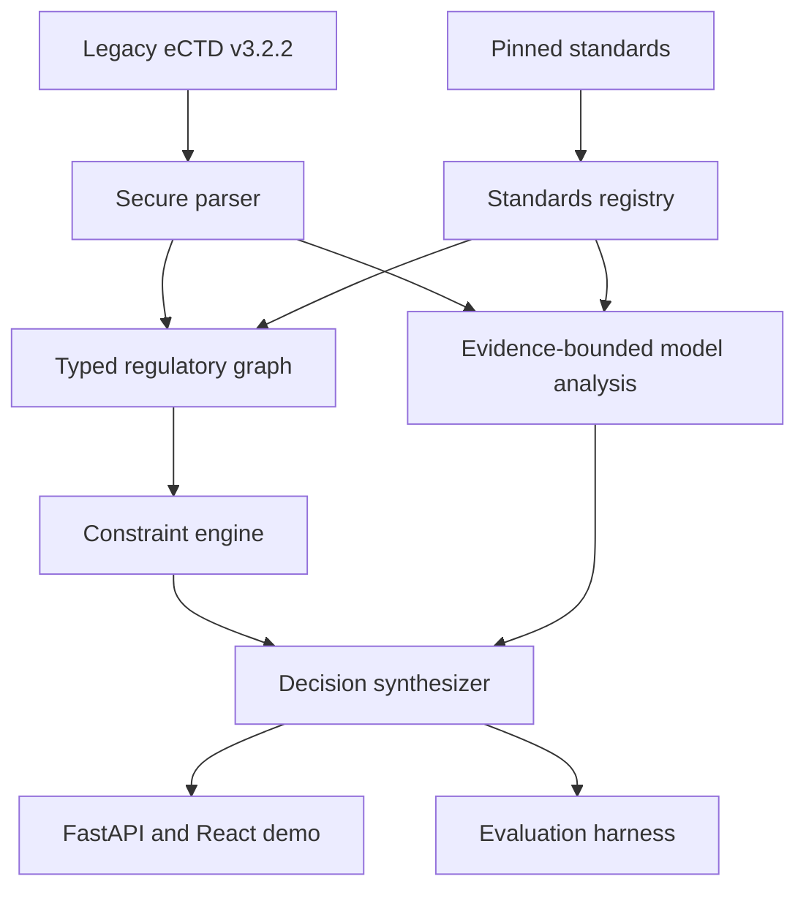

# RegBridge Implementation Specification

This document translates the RegBridge research idea into an implementation and evaluation plan for Codex. It is linked from [AGENTS.md](./AGENTS.md), whose instructions govern work in this repository.

## 1. Product statement

RegBridge is an FDA/CDER-scoped research prototype that analyzes whether content from an eCTD v3.2.2 submission should be reused in a selected eCTD v4.0 context.

Existing submission tooling can determine whether a file or lifecycle reference is syntactically possible. RegBridge focuses on the next decision: whether reuse is structurally, contextually, and evidentially defensible under the selected standards snapshot. It combines:

1. deterministic parsing of the legacy package;
2. a source-grounded, version-aware regulatory knowledge graph;
3. executable constraints for explicit structural and metadata requirements;
4. evidence-bounded model analysis for ambiguous content risk;
5. a traceable decision, minimal repair, and human-review boundary.

The MVP is a decision-support demonstrator, not a submission builder or acceptance predictor.

## 2. Research hypothesis

The primary hypothesis is:

> A hybrid system using a typed, version-aware regulatory graph and executable constraints will reduce unsafe false negatives and improve evidence-grounded explanations compared with a long-context agent, flat retrieval agent, and rule-only system.

The intended contribution is not merely ontology construction. It is the representation and enforcement of **versioned applicability**: which standard, rule, heading, keyword, and evidence applies to a legacy artifact in a particular target context and what action follows.

## 3. Why a graph is useful

A conventional document index can retrieve passages about headings, validation rules, or keywords. It does not naturally express that a rule:

- comes from a particular standard version;
- applies only to a given authority, center, application type, or date range;
- requires or prohibits a particular relation;
- supersedes another rule;
- is supported by a specific evidence span;
- triggers a repair only under a specific reuse context.

The graph therefore represents the regulatory objects and their qualified relationships. Executable constraints evaluate those objects. The language model is reserved for interpretations that are genuinely semantic rather than exact joins or comparisons.

Wikontic may be used as **methodological inspiration**, especially for candidate triple extraction, ontology domain/range validation, entity normalization, deduplication, and graph inspection. Do not copy its Wikidata-centered architecture wholesale. RegBridge requires stronger provenance, temporal and jurisdictional qualifiers, deontic rule semantics, review states, and an executable rule layer. If source code is reused, verify its license, preserve required attribution, isolate the adapted component, and document the architectural difference.

## 4. System boundary

### Inputs

- a controlled legacy eCTD v3.2.2 fixture or uploaded ZIP/directory;
- `index.xml`, `us-regional.xml`, optional `stf.xml`, and referenced files within the allowed fixture profile;
- an explicit target context containing target standard version, FDA center, application type, analysis date, and intended reuse operation;
- a pinned, source-verified standards snapshot;
- optional live OpenAI-compatible model configuration.

### Outputs

- normalized inventory of legacy leaves and referenced files;
- target-context compatibility findings;
- one allowed reuse decision per analyzed artifact;
- severity, confidence, and abstention state;
- triggered rules and complete evidence provenance;
- minimum repair or human-review recommendation;
- graph neighborhood and reasoning trace suitable for UI inspection;
- machine-readable records for benchmark evaluation and paper tables.

### Trust boundary

Uploaded packages and model responses are untrusted. Standards snapshots and rule definitions become usable only after schema validation and the documented author-review process below. A graph edge is not reliable merely because an extraction model produced it.

The MVP does not assume access to a regulatory professional with eCTD experience. Its regulatory representations are research-team operationalizations grounded in pinned official sources, not expert-validated regulatory ground truth. This limitation must remain visible in the interface, evaluation, paper, and video.

## 5. Proposed architecture



### Architectural rules

- Use a modular monolith for the MVP. Do not introduce microservices.
- Use in-process typed domain objects and a `networkx.MultiDiGraph`-compatible graph abstraction.
- Persist canonical records in SQLite plus JSON artifacts. The graph can be rebuilt deterministically; it is not the sole persistence layer.
- Use Pydantic models for service boundaries and JSON Schema exports for fixtures, rules, and model outputs.
- Keep standards ingestion, dossier parsing, graph construction, rule execution, model assistance, decision synthesis, baselines, and evaluation in separate modules.
- The React client consumes versioned JSON APIs. It must not contain regulatory decision logic.

## 6. Repository layout

Use this target structure unless an existing repository convention makes a small change clearly preferable:

```text
.
├── AGENTS.md
├── IMPLEMENTATION.md
├── README.md
├── Makefile
├── .env.example
├── backend/
│   ├── pyproject.toml
│   ├── app/
│   │   ├── main.py
│   │   ├── config.py
│   │   ├── api/
│   │   ├── domain/
│   │   ├── parsers/
│   │   ├── standards/
│   │   ├── graph/
│   │   ├── rules/
│   │   ├── llm/
│   │   ├── analyzer/
│   │   ├── baselines/
│   │   └── evaluation/
│   └── tests/
│       ├── unit/
│       ├── integration/
│       ├── security/
│       └── fixtures/
├── frontend/
│   ├── package.json
│   ├── vite.config.ts
│   └── src/
│       ├── api/
│       ├── components/
│       ├── features/
│       ├── pages/
│       ├── styles/
│       └── test/
├── data/
│   ├── standards/
│   │   ├── manifest.yaml
│   │   └── snapshots/
│   ├── demo-cases/
│   └── benchmark/
├── schemas/
├── scripts/
├── results/
│   └── .gitkeep
└── paper/
    ├── figures/
    └── tables/
```

Generated results should be separated from author-adjudicated benchmark reference labels. Commit only small canonical result snapshots needed for reproducibility; do not commit secrets, caches, uploaded user files, or large model traces.

## 7. Domain model

### 7.1 Target context

At minimum:

```json
{
  "authority": "FDA",
  "center": "CDER",
  "application_type": "NDA",
  "source_standard": "eCTD-3.2.2",
  "target_standard": "eCTD-4.0",
  "analysis_date": "2026-08-29",
  "reuse_operation": "reference-existing-content",
  "standards_snapshot_id": "fda-cder-demo-v1"
}
```

`application_type` must be explicit even if the first fixtures cover only one or two types. Out-of-scope values must trigger a scoped abstention rather than reuse of a nearby rule.

### 7.2 Core graph node types

| Node | Purpose |
|---|---|
| `StandardDocument` | An official FDA or ICH publication or technical artifact. |
| `StandardVersion` | A version/effective state of a standard. |
| `Rule` | A normalized requirement, prohibition, recommendation, or validation rule. |
| `EvidenceSpan` | The exact section, page, table row, XML node, or quoted span supporting a fact. |
| `RegulatoryAuthority` | FDA, with CDER captured in applicability context. |
| `ApplicationContext` | Authority, center, application type, dates, standards, and operation. |
| `CTDHeading` | A heading identifier and its availability in a standard version. |
| `KeywordDefinition` | A controlled metadata name/value and applicable definition. |
| `DossierEvidence` | One exact dossier occurrence with raw value, owner, locator, and deterministic provenance. |
| `ModelFinding` | A non-enforceable candidate semantic finding grounded in supplied occurrence evidence. |
| `ValidationCriterion` | A criterion identifier, severity, condition, and expected result. |
| `LegacyLeaf` | A parsed v3.2.2 lifecycle leaf. |
| `DossierDocument` | A referenced PDF or other allowed dossier file. |
| `ReuseDecision` | The synthesized decision record. |
| `RepairAction` | The smallest supported change or escalation. |

### 7.3 Core edge types

`VERSION_OF`, `SUPERSEDES`, `APPLIES_TO`, `DEFINED_BY`, `SUPPORTED_BY`, `LOCATED_UNDER`, `AVAILABLE_IN`, `REMOVED_IN`, `MAPS_TO`, `HAS_KEYWORD`, `CITES`, `ABOUT`, `OBSERVES`, `REFERENCES_DOCUMENT`, `REPLACES`, `CONFLICTS_WITH`, `REQUIRES`, `PROHIBITS`, `RECOMMENDS`, `TRIGGERS_DECISION`, and `REQUIRES_REPAIR`.

Graph schema v2 represents semantic metadata evidence as:

```text
MODEL_FINDING --CITES--> DOSSIER_EVIDENCE
MODEL_FINDING --ABOUT--> KEYWORD
DOSSIER_EVIDENCE --OBSERVES--> KEYWORD
```

This is an author-01-approved M3 design deviation from the originally proposed discriminated
occurrence-evidence union (`DOCUMENT_EVIDENCE`, `METADATA_EVIDENCE`, and
`STRUCTURAL_EVIDENCE`). The union was **not implemented**. It was replaced by one
`DOSSIER_EVIDENCE` occurrence node type carrying an `evidence_kind` discriminator. This simpler
representation is semantically equivalent for the controlled M3 graph operations: every
occurrence still carries raw value, owner, locator, and provenance; request-local aliases still
protect durable identity; and Case A, B, and C evidence remains in the valid `CITES` range.
The built edge is therefore `DOSSIER_EVIDENCE → OBSERVES → KEYWORD`, rather than the originally
named `METADATA_EVIDENCE → OBSERVES → KEYWORD`. This deviation and its rationale are inputs to
the evaluation configuration digest and are disclosed in graph-build and live-run manifests.

`CITES → KEYWORD` is invalid. `ABOUT` never substitutes for an occurrence citation. For a
metadata finding, its `ABOUT` target must equal the keyword `OBSERVES` target of cited metadata
evidence unless a separately supported cross-concept relation is encoded; M3 encodes no such
relation. Durable occurrence identifiers and provenance resolve server-side after de-aliasing;
the model receives request-local aliases only.

Every node and edge has a stable identifier and type. Regulatory graph assertions also carry:

- authority and jurisdiction;
- FDA center and application-type scope;
- source and target standard versions;
- valid-from and valid-to values when known;
- source document, version, and locator;
- bindingness and severity;
- extraction method (`manual`, `deterministic`, or `model_candidate`);
- review status (`candidate`, `source_verified`, `author_adjudicated_for_demo`, or `rejected`);
- verification basis (`direct_standard_encoding`, `mechanical_derivation`, `author_interpretation`, `semantic_inference`, or `synthetic_assumption`);
- expert-validation flag, which is `false` unless a qualified external reviewer actually reviews the item;
- confidence for probabilistic assertions;
- exact evidence-span identifier.

`author_adjudicated_for_demo` means that the research team has checked the source and accepted a specific operationalization for the frozen benchmark. It does not mean that FDA, an eCTD professional, or another external authority has endorsed it. Codex, an extraction model, or the semantic-analysis model may create `candidate` assertions but may never promote their review status.

### 7.4 Evidence and rule governance

The research team may assign review statuses through a documented process:

1. `candidate` — newly extracted, generated, or drafted and not permitted to drive an enforceable conclusion.
2. `source_verified` — an author has confirmed the official source snapshot, digest, transcription, locator, version, and applicability metadata. This status is primarily for evidence spans and direct source facts.
3. `author_adjudicated_for_demo` — after source verification, an author has accepted the formalized rule or assertion for the controlled research benchmark. This is an internal research approval, not expert regulatory validation.
4. `rejected` — unsupported, incorrectly encoded, duplicated, contradicted, or outside the declared scope.

For an `EvidenceSpan`, source verification confirms only that the evidence and its provenance are represented accurately. For a `Rule`, author adjudication additionally confirms that the encoded predicate, applicability, severity, decision, and repair are a defensible research operationalization of that evidence.

Each review event must record:

- reviewer identifier and role;
- review date;
- reviewed object and version;
- source snapshot and digest;
- decision and rationale;
- unresolved assumptions or conflicts;
- whether an independent second-author check occurred;
- `expert_validated`, which defaults to `false`.

Use a two-pass author review when feasible: first verify the source and locator, then re-check the formalized rule against the source in a separate pass. A coauthor without specialist eCTD experience may perform the second pass for transcription, logic, and reproducibility, but this must not be described as regulatory-expert validation.

Rules also declare an enforcement mode:

- `hard` — permitted only for direct standard encodings or mechanical derivations with exact official evidence and no material interpretive gap;
- `advisory` — used for author interpretations, recommendations, and context-sensitive guidance; may add risk or escalate to `HUMAN_REGULATORY_REVIEW`, but cannot alone produce a definitive compliance conclusion;
- `semantic_signal` — used for model-assisted observations such as stale wording or hyperlinks; must cite supplied evidence and cannot override a hard rule;
- `disabled` — retained for auditability but excluded from decisions.

If the research team cannot determine whether a rule is a direct encoding or an interpretation, classify it as `advisory`. The architecture should permit later external expert review without requiring it for the MVP.

### 7.5 Parsed legacy leaf

Capture at least:

- leaf ID and lifecycle operation;
- source XML path and node locator;
- referenced file path and checksum;
- CTD heading path;
- title and relevant regional metadata;
- keywords/attributes needed by scoped rules;
- replacement/reference relationships;
- parse warnings;
- extracted text spans and hyperlink targets when the file profile allows them.

Preserve raw values alongside normalized values. Never discard a source value merely because normalization failed.

## 8. Standards registry and graph formation

### 8.1 Frozen source manifest

`data/standards/manifest.yaml` is the standards source of truth. Each entry must include:

```yaml
id: stable-source-id
title: Human-readable title
authority: FDA
center: CDER
version: explicit-version-or-date
source_url: https://...
retrieved_at: 2026-08-29T00:00:00Z
local_path: snapshots/example.pdf
sha256: ...
bindingness: requirement
scope:
  application_types: [NDA]
  source_standards: [eCTD-3.2.2]
  target_standards: [eCTD-4.0]
review_status: source_verified
verification_basis: direct_standard_encoding
expert_validated: false
notes: ...
```

The initial registry should include only official materials necessary to support the three cases and the eCTD structural parser. Maintain a human-readable source ledger that maps each executable rule to its exact source locator.

### 8.2 Formation pipeline

1. Register and hash the official source snapshot.
2. Segment it into stable evidence spans with source locators.
3. Extract candidate entities and relations deterministically where tables/XML permit it.
4. Optionally use a model to propose triples from prose.
5. Validate candidate triples against allowed node types, edge types, domain/range, qualifiers, and evidence requirements.
6. Normalize identifiers and deduplicate without merging different versions or scopes.
7. Source-verify evidence and author-adjudicate any rule before it can participate in the controlled demonstration.
8. Build the graph and run integrity checks.
9. Export a frozen graph snapshot and build manifest for evaluations.

Borrow the useful discipline of ontology-aware extraction from Wikontic, but add regulatory-specific validation:

- no assertion without an evidence span;
- no rule without version and applicability qualifiers;
- no silent merge across standard versions;
- no `REQUIRES` or `PROHIBITS` edge inferred solely from weak language;
- no candidate edge treated as enforceable before author adjudication;
- no author interpretation or semantic inference assigned `hard` enforcement mode;
- no internal author review described as FDA, professional, or expert validation.

### 8.3 Graph integrity checks

Fail the build when:

- a rule lacks evidence or scope;
- an evidence span points to an unknown source digest;
- an edge violates its domain or range;
- a heading availability assertion has no standard version;
- a model finding cites a concept instead of supplied occurrence evidence;
- an `ABOUT` edge lacks occurrence-level `CITES` evidence or disagrees with the keyword
  `OBSERVES` target of the cited metadata occurrence;
- a model-originated `CITES` or `ABOUT` edge is promoted beyond disabled candidate status;
- two source-verified or author-adjudicated assertions conflict at the same scope without an explicit conflict record;
- a decision-triggering rule points to an unknown decision or repair;
- a `hard` rule is based on `author_interpretation`, `semantic_inference`, or `synthetic_assumption`;
- `expert_validated` is true without a recorded external reviewer and review event;
- identifiers are unstable across two builds from identical inputs.

## 9. Rule and constraint engine

Represent rules as versioned data validated by Pydantic and exported as JSON Schema. Python evaluators may implement predicates, but the regulatory statement, applicability, evidence, severity, and action must remain visible in data.

Example shape:

```yaml
id: FDA-CDER-M1-REMOVED-SUBHEADING-001
title: Removed 3.2.S.1 subheadings require a new target context group
bindingness: requirement
applies_when:
  authority: FDA
  center: CDER
  source_standard: eCTD-3.2.2
  target_standard: eCTD-4.0
predicate:
  type: explicit_heading_mapping
  mapping:
    3.2.S.1.1: 3.2.S.1
    3.2.S.1.2: 3.2.S.1
    3.2.S.1.3: 3.2.S.1
severity: blocking
decision: REUSE_WITH_NEW_CONTEXT
repair: CREATE_NEW_CONTEXT_GROUP_AND_SUSPEND_LEGACY_CONTENT
evidence_ids:
  - ev-ctoc-321-remains
  - ev-ctoc-3211-3213-removed
  - ev-tcg-replacement-context-same
  - ev-tcg-new-context-and-reuse
review_status: author_adjudicated_for_demo
verification_basis: mechanical_derivation
expert_validated: false
enforcement_mode: hard
scenario_mode: prospective_forward_compatibility
```

The example expresses an author-adjudicated research encoding for the controlled prospective FDA/CDER demonstration. It must not be described as an expert-certified FDA rule. Do not generalize this into a nearest-available-parent algorithm: only the three explicit source-supported mappings above are authorized. FDA forward compatibility is currently `not_operational`; current-operational mode must report that status and bypass this prospective rule.

### Rule precedence

Use a deterministic, tested precedence policy:

1. author-adjudicated `hard` prohibition or unrecoverable target conflict → `DO_NOT_REUSE`;
2. author-adjudicated `hard` lifecycle-breaking structural requirement → `BREAK_LIFECYCLE_AND_RESUBMIT`;
3. author-adjudicated `hard` repairable exact metadata conflict → `REUSE_AFTER_METADATA_REPAIR`;
4. new contextual material needed but original may remain → `REUSE_WITH_NEW_CONTEXT`;
5. no material finding and sufficient evidence → `REUSE_AS_LEGACY_REFERENCE`;
6. missing, contradictory, low-confidence, or out-of-scope evidence → `HUMAN_REGULATORY_REVIEW`.

This is not a simple numeric maximum. An `advisory` rule or `semantic_signal` may escalate a permissive result to `HUMAN_REGULATORY_REVIEW`, but it cannot independently produce `DO_NOT_REUSE`, `BREAK_LIFECYCLE_AND_RESUBMIT`, or a claim of noncompliance. A semantic finding cannot reduce the severity of a deterministic hard finding. Multiple triggered rules must all remain visible even when one controls the primary decision.

Use severities `informational`, `low`, `medium`, `high`, `blocking`, and `unresolved`. Keep severity distinct from the decision label.

## 10. Model abstraction

### 10.1 Interface

Define a small provider-neutral interface such as:

```python
class StructuredModel(Protocol):
    async def complete(self, request: ModelRequest, output_type: type[T]) -> T: ...
```

Required implementations:

- `OpenAICompatibleModel`: configurable base URL, model name, API key, timeout, retry policy, and structured JSON response handling;
- `FixtureModel`: returns deterministic, versioned responses keyed by fixture ID;
- optionally `DisabledModel`: produces a typed abstention for rule-only runs.

Recommended environment contract:

```text
LLM_MODE=fixture|live|disabled
LLM_BASE_URL=
LLM_API_KEY=
LLM_MODEL=
LLM_TIMEOUT_SECONDS=60
```

Tests and the default demo must use `fixture`. The live path must be opt-in and must not change benchmark reference labels.

### 10.2 Prompt and output constraints

- Supply only evidence spans and structured context relevant to the task.
- Give each span a stable identifier.
- Require citation of one or more supplied evidence identifiers for every substantive finding.
- Fixture evaluations retain their frozen decoding configuration. For the declared `gpt-5.5`
  Responses live evaluation, omit temperature as explicitly approved by author-01; record
  `temperature_handling: unsupported_by_endpoint_parameter`, with no effective-zero claim.
- Reject unknown labels, uncited claims, malformed JSON, and citations to absent evidence.
- Record prompt-template version, model configuration, token usage, latency, and validation errors.
- Do not log API keys or entire uploaded documents.
- The declared live evaluation permits an initial attempt plus two retries only for transport
  or provider-API failures, without changing prompts or settings. Refusal, schema, citation,
  graph, persistence, synthesis, incomplete-response, and answer-length failures are
  non-retryable. They halt Phase 1 immediately, remain `invalid_output`, roll back transactional
  persistence, and carry a non-null auditable cause. A null retry cause is itself fatal.

The semantic-risk output should distinguish direct observation from inference and include `abstain_reason`.

## 11. Analyzer pipeline

For each selected legacy leaf:

1. validate the target context and standards snapshot;
2. load the parsed leaf, file metadata, relevant text, and hyperlinks;
3. query the graph for heading, keyword, validation, lifecycle, and evidence relationships applicable to the exact context;
4. execute deterministic rules;
5. construct a minimal evidence packet for semantic analysis;
6. validate the model response and discard unsupported findings;
7. synthesize the final decision using precedence and abstention policy;
8. generate a minimal repair from author-adjudicated rule actions, not free-form speculation;
9. persist a complete trace and return a redacted API representation;
10. expose the relevant graph neighborhood for explanation.

The same analyzer path must run the three demo archetypes and their variants. Case IDs may select inputs, but no branch may select a predetermined decision.

## 12. Demonstration cases and benchmark

Create approximately 30 controlled cases: ten variants per archetype. The exact number may change slightly if the user approves, but every archetype must contain:

- positive/high-risk examples;
- clean negative examples;
- ambiguous examples that should abstain;
- perturbations that prevent matching on a single keyword or file name.

### Case A — unavailable heading

Variants should change leaf titles, file names, and sibling placement while preserving or removing the actual heading conflict. The controlled prospective mapping is fixed to `3.2.S.1.1`, `3.2.S.1.2`, and `3.2.S.1.3` → `3.2.S.1`; do not create novel target mappings as synthetic variants. Include a case where `3.2.S.1` remains valid so the analyzer does not over-trigger, and an unmapped heading that must abstain rather than infer a parent.

### Case B — legacy metadata tension

Variants should distinguish an existing legacy reference from creation of a new target artifact. Include exact matching, missing values, discouraged values, and an out-of-scope keyword. The author-adjudicated reference rationale must explicitly state why lifecycle context changes the recommendation.

### Case C — stale content or hyperlink

Use small synthetic PDFs with controlled text and link annotations. Vary obsolete headings, applicant names, internal destinations, and benign historical statements. Include subtle and ambiguous language requiring human review.

### Benchmark record

Each benchmark item should contain:

```json
{
  "case_id": "case-a-001",
  "archetype": "unavailable-heading",
  "input_fixture": "...",
  "target_context_id": "...",
  "reference_decision": "REUSE_WITH_NEW_CONTEXT",
  "reference_severity": "blocking",
  "required_rule_ids": ["FDA-CDER-M1-REMOVED-SUBHEADING-001"],
  "acceptable_evidence_ids": ["ev-ctoc-321-remains", "ev-ctoc-3211-3213-removed", "ev-tcg-replacement-context-same", "ev-tcg-new-context-and-reuse"],
  "required_repair_type": "CREATE_NEW_CONTEXT_GROUP_AND_SUSPEND_LEGACY_CONTENT",
  "human_review_required": true,
  "reference_rationale": "...",
  "adjudication": {
    "status": "author_adjudicated_for_demo",
    "expert_validated": false,
    "reviewer_id": "author-01",
    "reviewed_at": "2026-08-29T00:00:00Z"
  },
  "split": "test",
  "provenance": "synthetic-mutation-spec-v1"
}
```

These are author-adjudicated **reference labels**, not expert regulatory ground truth. Every label must map to official evidence, a declared synthetic assumption, or an explicit ambiguity policy. Freeze train/development/test partitions before final experiments. If examples are used for prompt development, they cannot remain hidden test cases.

## 13. Baselines

All systems use the same source snapshot, case inputs, author-adjudicated reference labels, and evaluation harness.

### B0 — long-context document agent

Provide the target context, legacy artifact, and the relevant standards corpus directly in one model context up to a declared deterministic limit. No graph queries or programmatic constraints. Require the same structured decision schema and evidence identifiers.

This is the minimum baseline specifically requested by the research plan.

### B1 — flat retrieval agent

Chunk the same standards snapshot and retrieve top-k spans using a fixed, reproducible retrieval method. A local BM25 or TF-IDF implementation is acceptable for the first complete run; if embeddings are later added, keep the lexical result as a named baseline. Do not traverse typed graph edges or execute constraints.

### B2 — rule-only analyzer

Run the same parser, graph facts, and deterministic constraints as RegBridge but disable semantic model analysis. This isolates the value of the semantic component, especially for stale content.

### Proposed — RegBridge

Run the complete graph, constraint, and evidence-bounded semantic pipeline.

For model-based systems, hold model, decoding parameters, schema, and maximum relevant context as constant as practical. Report unavoidable differences. Cache immutable live-model responses by request digest for auditability, while keeping secrets and licensed full text out of committed artifacts.

## 14. Evaluation

### 14.1 Primary metrics

- **Unsafe false-negative rate:** fraction of references requiring any action, context change,
  repair, non-reuse, or review that receive unconditional `REUSE_AS_LEGACY_REFERENCE`.
  Report numerator, denominator, rate, and a 95% Wilson interval. Report the high/blocking-
  severity restriction separately as sensitivity analysis, not as the primary denominator.
  This is a controlled benchmark metric, not an estimate of real FDA acceptance risk.
- **High-risk recall:** recall for cases requiring lifecycle break, non-reuse, or human review due to material uncertainty.
- **Macro-F1:** equal weighting over the three represented M3 reference classes only:
  `REUSE_WITH_NEW_CONTEXT`, `REUSE_AS_LEGACY_REFERENCE`, and `HUMAN_REGULATORY_REVIEW`.

### 14.2 Supporting metrics

#### Declared development contract v3 / graph schema v2

All four final output schemas permit the same six decisions in `AGENTS.md` §5. B0/B1 direct
outputs and RegBridge/B2 final repairs use one case-independent action enum derived from the
existing analyzer and rule repair semantics. RegBridge's semantic request receives the same
full vocabulary, but retains its evidence-inspection role; the model does not execute repairs
or select the final hybrid decision. The current rule set structurally emits only three of
the six permitted decisions. Disclose this architectural restriction in manifests, rather
than restricting any model's output options to the benchmark distribution.

The 11 action codes and all 11 effect-only definitions are approved by author-01 for the
declared fresh Phase 1 development run. The approved packet and configuration digests are
The action packet approval remains recorded in `data/evaluation/phase1-v2-approval.json`.
The subsequent graph-contract/retry-integrity development authorization is recorded separately
in `data/evaluation/phase1-v3-approval.json`; neither is held-out authorization or
a prompt freeze. Supply the identical alphabetically ordered code/definition packet to B0, B1,
RegBridge's semantic request, and B2's scoring contract. Definitions describe effects, never
trigger conditions or decision associations. Keep the two context-creation codes distinct:
content-placement change versus context-group metadata change, both with identifier reuse.
Record the packet and its origin in configuration and manifests: B0/B1 receive the taxonomy
derived from RegBridge's repair semantics, not an unassisted generic-LLM action space.
The Phase 1 runner fails before data/model access until explicit author-01 approval identifies
the complete packet (including definitions) and current configuration digests. No approval
event is created automatically. Recompute the configuration digest after definition approval;
do not create a prompt freeze. All subsequent Phase 1 responses must be freshly generated.

Before live inference in the approved rerun, freshly rescore B2 from only the isolated 18-case
train/development bundle using option (a) and the shared action enum. It is outside the 54
live-system/case schedule and makes no model calls. Preserve its genuine deterministic
experimental status but mark development results ineligible for performance claims. Export
its own prediction/metric artifact and reference its digest from the live manifest. A complete
cross-system development table requires all 54 fresh live outcomes plus B2 coverage and exact
configuration/packet/bundle digest agreement. Old-contract B2 artifacts cannot substitute.

Option (a) scoring is exact match against the reference. A prediction outside the three
represented reference classes is an error and reduces recall for its true reference class;
it contributes to no represented class's precision denominator. Macro-F1 remains the mean
of the three represented-class F1 scores. This benchmark does not evaluate the complete
six-label taxonomy. Invalid model output is excluded from decision denominators, separately
reported, and never converted to any decision class.

For every scored system/split, report outside-class count/rate and a breakdown by each
predicted outside class (including zero counts). Rates use all valid predictions in the
scope. Also report accuracy after excluding outside-class predictions as **sensitivity only**,
with included/excluded counts and null accuracy if none remain. It is never an alternative
headline result. Primary tables always retain outside-class predictions as errors.

Review-bypass and unsafe-FNR have equal prominence in decision-summary tables. When no
`REUSE_AS_LEGACY_REFERENCE` prediction occurred, explicitly state that zero unsafe-FNR does
not establish safety. Withhold RegBridge decision metrics until all 18 development outcomes
complete; an incomplete run cannot support cross-system comparison. Preserve raw partial
outputs for audit. Do not propose a Phase 2 output cap from partial development observations.

Contract acceptance is based on defect cessation, not accuracy or F1 movement. The before/
after audit distinguishes schema/serialization checks, rescoring unchanged historical outputs,
and fresh inference (unavailable until rerun approval). Do not present replayed outputs or
network-free probes as new empirical observations. Original failed outputs remain unchanged.

Live requests use request-local evidence/identifier aliases, including UUIDs and embedded
case-derived locator text. Map citations back only after checking that they were supplied.
The semantic wire severity enum is limited to informational/low/medium/high, with the
existing runtime validator retained. Source artifacts, labels, and regulatory rules are
not changed by these contract corrections. Both schemas, the action/decision vocabulary,
serializers, and scoring policy are included in the new configuration digest.

`DirectDecisionOutput.severity` intentionally retains the complete decision-level severity
vocabulary, including `unresolved`, because a direct system may issue a final human-review
decision under unresolved uncertainty. That value is not allowed for `SemanticFinding`, whose
informational/low/medium/high boundary preserves semantic-signal governance.

Graph contract v2 is a versioned graph-build correction, not a benchmark-label change.
Metadata occurrences remain `DOSSIER_EVIDENCE`; separate normalized `KEYWORD` nodes are linked
by `OBSERVES`, while a model finding both `CITES` the occurrence and is `ABOUT` the keyword.
The approved discriminated evidence union was not implemented; a single occurrence node with
an `evidence_kind` discriminator replaced it as a simpler semantically equivalent M3
representation. This approved deviation is a paper disclosure item and participates in live
configuration digests.
The prior frozen M3 fixture artifacts remain available for audit. A new deterministic validation
build and manifest record the new graph schema, unchanged benchmark digest, prompt/serializer
digests, and reproducible graph content digests.

- decision accuracy;
- heading mapping accuracy;
- evidence citation precision/recall and citation validity;
- repair-action exact or adjudicated accuracy;
- human-review/abstention precision and recall;
- calibration, using Brier score or expected calibration error when probabilities are meaningful;
- median and p95 latency;
- model requests, input/output tokens, and estimated cost when available;
- graph build time and analyzer runtime.

### 14.3 Reproducibility record

Every evaluation run writes a manifest containing:

- git commit or source-tree digest;
- timestamp, random seed, and run ID;
- benchmark and standards snapshot digests;
- graph and rule-set versions;
- system and baseline configuration;
- model provider-neutral configuration without secrets;
- prompt-template versions;
- per-case outputs, validation errors, timings, and aggregate metrics.

Generate Markdown/CSV/JSON tables under `results/` and paper-ready tables under `paper/tables/`. Claims in the paper must be traceable to a run manifest.

Fixture-mode output determinism and its reproduction checks remain unchanged. Live-mode runs
claim **configuration and artifact reproducibility only**, not output reproducibility. Three
separate Phase 2 repetitions characterize run-to-run variation; no voting, pooled predictions,
or cached-response substitution is permitted.

The declared Phase 1 runs only the isolated 12-train/6-development bundle. Its manifests and
metrics are `live_model_run`, `empirical_model_run: true`, and
`eligible_for_performance_claims: false`. They cannot support headline performance claims.
Keep artifacts in `results/live/` and `paper/tables/live/`, separate from fixture validation.

Two author-approved pre-live deviations from the M3 frozen fixture configuration apply equally
to B0, B1, and RegBridge's semantic component: (1) `max_output_tokens: 25000` for Phase 1
measurement, retaining the separately tokenized 800-token final structured-answer bound;
(2) omission of temperature with `temperature_handling: unsupported_by_endpoint_parameter`.
The second deviation is grounded in run `m3-live-phase1-20260831T172522Z`: HTTP 400,
`invalid_request_error`, `error_param: temperature`. Do not represent this as temperature zero
being requested or taking effect in subsequent runs. Prompt wording is unchanged.

Both actual API output schemas, both validation schemas, both prompt templates, the wrapper
instructions, serializers, reasoning effort, total output cap, final-answer bound, input limit,
temperature handling, retry policy, graph domain/range contract, occurrence-identity policy,
analysis pipeline, and persistence boundary participate in `configuration_sha256`.
`prompt_template_digests` includes `direct_schema` and `semantic_schema`. Author approval must
identify the prompts, derived cap, temperature handling, and complete configuration before
Phase 2. The frozen configuration and prompt digests are recomputed before held-out loading,
every repetition, and every dispatch; any mismatch aborts before the operation. Author-01
approved Phase 1 as complete and authorized the Phase 2 prompt freeze on 2026-09-01. The
held-out configuration uses `gpt-5.5`, reasoning effort `medium`,
`max_output_tokens: 4000`, the unchanged 800-token structured-answer limit, the unchanged
16,000-character input limit, omitted temperature with
`unsupported_by_endpoint_parameter`, and the existing transport/provider-API-only retry
policy. The prepared manifest exposes both frozen digests before the held-out bundle is loaded.
Three repetitions per live system remain separate runs; do not vote, pool, or substitute cached
responses. B2 is recomputed once without a model call. Only a complete Phase 2 held-out audit
may set `eligible_for_performance_claims: true`. FDA availability remains `not_operational`
and `expert_validated: false` throughout.

### 14.4 M3 presentation safeguards

- Every decision-results table includes `Result status`: B0/B1/RegBridge are
  `fixture validation only`; B2 is `genuine deterministic experimental output`.
- Canned end-to-end scores validate the harness and contracts only. Neither the perfect
  B0/RegBridge scores nor B1's end-to-end accuracy belongs in the paper's empirical results
  table. Keep the all-system tables in `validation/`; export B2 alone in `deterministic/`.
- B1's actual BM25 recall@3, precision@3, and MRR are measured retrieval results, independent
  of the canned decision response. Export them separately in `retrieval/`, with the evaluated
  case count and without end-to-end decision scores.
- Retain Wilson and bootstrap calculations in raw scorer outputs for regression testing.
  For canned outputs mark their interval use `scorer validation only; no statistical
  interpretation`, and omit their interval values from presentation tables. No independence
  or significance claims follow from the controlled family design.
- Report B2's unsafe-miss family count over the held-out families with action-required cases,
  separately from the total six held-out families; derive both counts from scored family data.

## 15. API specification

Use a versioned prefix such as `/api/v1`. Minimum endpoints:

| Method and path | Purpose |
|---|---|
| `GET /health` | Process health and dependency status without secrets. |
| `GET /api/v1/config/scope` | Supported authority, center, standards, cases, and disclaimer. |
| `GET /api/v1/standards/snapshots` | Frozen snapshot metadata and review state. |
| `POST /api/v1/applications/parse` | Securely parse an allowed fixture/upload and return an inventory. |
| `POST /api/v1/analyses` | Start or perform an analysis for a leaf and target context. |
| `GET /api/v1/analyses/{id}` | Return decision, findings, evidence, repair, and uncertainty. |
| `GET /api/v1/analyses/{id}/graph` | Return a bounded explanatory subgraph. |
| `POST /api/v1/baselines/run` | Run a named baseline for authorized demo data. |
| `POST /api/v1/evaluations` | Run a benchmark configuration. |
| `GET /api/v1/evaluations/{id}` | Return status, manifest, metrics, and per-case links. |

Long evaluations may run as in-process background jobs for the MVP, but job state must be explicit. Limit concurrency and do not expose arbitrary filesystem paths or shell commands.

Generate and commit the OpenAPI schema as a reviewable artifact. Frontend API types should be generated from or checked against it.

## 16. Frontend specification

Use React, TypeScript, Vite, Tailwind CSS, Iconoir, React Router, and TanStack Query. Use React Flow for the bounded explanation graph unless an early spike demonstrates a material accessibility or layout problem.

### Required views

1. **Project and scope overview** — one-sentence research question, FDA/CDER scope, standards snapshot, research disclaimer, and fixture/upload entry point.
2. **Application inventory** — parsed leaves, headings, lifecycle operations, file status, and parse warnings.
3. **Analysis workspace** — target context, primary decision, severity, uncertainty, triggered findings, minimal repair, and chronological reasoning trace.
4. **Evidence drawer** — exact source title/version/locator, evidence span, bindingness, applicability, digest, and review status.
5. **Graph explorer** — only the nodes and edges relevant to the current finding, with a text/table alternative.
6. **Baseline comparison** — side-by-side outputs for B0, B1, B2, and RegBridge with unsafe misses highlighted without editorial manipulation.
7. **Evaluation dashboard** — primary metrics, confusion matrix or label table, per-case drill-down, run manifest, and export actions.

### Interaction principles

- Optimize the five-minute demonstration path; avoid a generic admin dashboard.
- Reveal the evidence behind every decision in at most one interaction.
- Distinguish observed facts, deterministic rule results, model inferences, and human-review needs visually and textually.
- Do not imply certainty through color alone. Pair colors with labels and icons.
- Use Iconoir icons consistently and include accessible names for icon-only controls.
- Provide fixture selection so the demo works without uploading confidential material.
- Keep the graph focused; the key interaction is inspecting why a rule applies, not watching an enormous network animate.

## 17. Security and data handling

The parser must:

- reject absolute paths, parent traversal, symlink escape, and duplicate ambiguous archive members;
- recognize only approved DOCTYPE declarations through an exact identifier-to-pinned-local-file
  catalog while disabling network retrieval, untrusted filesystem resolution, entity expansion,
  internal subsets, archive-supplied DTD execution, and every external resource not in the catalog;
- enforce compressed and expanded size limits, member-count limits, and timeouts;
- allowlist expected file types for the MVP;
- calculate checksums while streaming where feasible;
- parse in a per-request temporary directory and clean it safely;
- never execute macros, scripts, or embedded content;
- treat PDF extraction failures as explicit warnings or abstention reasons.

The service must validate request size, use opaque analysis IDs, avoid leaking local paths, and redact document text from default logs. Production authentication is out of scope, so bind locally by default and state that the prototype is not ready for public deployment.

## 18. Testing strategy

### Backend unit tests

- XML namespaces and legacy leaf extraction;
- lifecycle/reference resolution;
- path and checksum behavior;
- standards manifest validation;
- graph domain/range and provenance validation;
- each deterministic rule and precedence combination;
- structured model validation and abstention;
- metric calculations.

### Backend integration tests

- each archetype through the same analyzer service;
- clean negative and ambiguous case;
- graph rebuild determinism;
- API error contracts and OpenAPI snapshot;
- all baselines through the shared evaluation runner;
- complete run-manifest reproduction using `FixtureModel`.

### Security tests

- `../` and absolute archive paths;
- symlink and duplicate-member cases;
- XML external entity and entity-expansion attempts;
- oversized and over-membered archives;
- unsupported MIME/file extensions;
- malformed PDF and XML behavior.

### Frontend tests

- component tests for decision, evidence, severity, and uncertainty displays;
- API contract mocks;
- keyboard navigation and accessible names;
- one end-to-end demonstration journey covering parse → analyze → evidence → graph → baseline comparison;
- visual smoke checks for common desktop demo dimensions.

No default test may require network access or a model key.

## 19. Delivery milestones

The target AAAI 2027 Demonstration Track deadline is close, so prioritize a complete, defensible vertical prototype over broad standards coverage. Treat the dates below as working targets and record deviations explicitly.

### M0 — Scaffold and contracts (August 29–30)

Deliver:

- backend/frontend scaffolds and repeatable commands;
- core Pydantic models, enums, schemas, and configuration;
- standards manifest format and one source-verified example source;
- offline model fixture interface;
- visible disclaimer and scope endpoint.

Exit criteria: lint/test/build commands work from a clean checkout with no model key.

### M1 — First vertical slice: heading case (August 31–September 3)

M1 is a clearly labeled prospective forward-compatibility research scenario. The API, UI, paper, and demonstration must keep FDA operational availability visible as `not_operational`. Current-operational mode bypasses the prospective rule and returns an unresolved human-review result.

Deliver:

- secure v3.2.2 parser for the scoped fixture profile;
- heading/version graph model and first author-adjudicated rules;
- documented source-verification and author-adjudication records for the first rules;
- deterministic unavailable-heading analysis;
- API and UI showing decision, evidence, repair, and graph neighborhood;
- positive, negative, ambiguous, and hostile-input tests.

Exit criteria: Case A works end to end without a hard-coded case decision.

### M2 — Metadata and semantic cases (September 4–7)

Deliver:

- metadata/lifecycle constraints for Case B;
- PDF text and hyperlink evidence extraction for controlled fixtures;
- OpenAI-compatible and fixture-backed semantic analyzer for Case C;
- decision synthesis, precedence, uncertainty, and trace views;
- about 30 drafted benchmark variants with provenance.

Exit criteria: all three archetypes, including clean and abstention examples, use one analyzer path.

### M3 — Baselines and evaluation (September 8–10)

Deliver:

- B0 long-context, B1 flat retrieval, and B2 rule-only baselines;
- frozen benchmark split and author-adjudicated reference labels;
- shared runner, metrics, run manifest, and paper-table exports;
- deterministic offline evaluation plus one optional declared live-model run.

Exit criteria: one command produces comparable per-case and aggregate results for all four systems.

#### Frozen M3 realization

- The benchmark contains exactly 30 author-adjudicated controlled prospective cases: 12 train,
  six development, and 12 held-out test cases. The held-out set is balanced 4/4/4 across
  `REUSE_WITH_NEW_CONTEXT`, `REUSE_AS_LEGACY_REFERENCE`, and
  `HUMAN_REGULATORY_REVIEW`, using six non-overlapping held-out fixture families. No independence
  or significance claim is made.
- Promotion requires a generated and validated pre-freeze ledger followed by explicit
  `author-01` approval. The ledger command cannot create adjudication events or freeze the
  benchmark. Atomic promotion verifies the approved ledger digest and records
  `expert_validated: false` for every case.
- A005 analyzes one exact selected leaf: `operation="append"`, with
  `modified-file="leaf-a005-predecessor"`; that predecessor exists with `operation="new"`. These
  predicates participate in the decision fingerprint.
- B0 and B1 use identical label-free case serialization, fixed evidence-ID ordering, one direct-
  decision schema, temperature zero, a 16,000-character input limit, and an 800-token output
  limit. Inputs above the limit fail validation; evidence is never silently truncated.
- B1 uses only the six source-verified evidence spans, BM25 `top_k=3`, `k1=1.5`, `b=0.75`, IDF
  `log(1+(N-df+0.5)/(df+0.5))`, NFKC/casefold tokenization that preserves dotted CTD identifiers,
  and evidence-ID tie breaking.
- B2 omits semantic capability without converting omission into abstention. Its tests exercise
  the capability boundary and deterministic guards, never case-ID-specific output mappings.
- Deterministic runs are labeled `deterministic_fixture_validation`,
  `empirical_model_run: false`, and `eligible_for_performance_claims: false`. B0, B1, and
  RegBridge fixture outputs are contract fixtures. Only genuine B2 rule-only output is an
  experimental result; a later declared live-model run is required for model-comparison or
  RegBridge-superiority claims.
- Headline metrics use only the 12 held-out cases. All-30 metrics are secondary diagnostics.
  Family-clustered bootstrap intervals sample all six held-out families, including families
  with zero action-required cases; zero-denominator replicates are omitted. Family counts
  remain visible even when their unsafe-FNR denominator is zero. Intervals are exploratory.
  Source-tree digests exclude caches, build outputs, runtime databases, local secrets, and
  generated evaluation artifacts; byte-pinned inputs are protected from Git newline conversion.
  FDA operational availability remains
  `not_operational` in every API, manifest, paper table, and demonstration artifact.

### M4 — Demonstration polish (September 11–14)

Deliver:

- optimized five-minute workflow and fixture selector;
- baseline comparison and evaluation dashboard;
- evidence and graph accessibility pass;
- error recovery and demo reset workflow;
- final tests, security checks, and reproducibility instructions.

Exit criteria: a fresh local setup can run the scripted demo twice with identical fixture-mode results.

### M4.1 — End-to-End Dossier Workspace and Interactive System Comparison

M4.1 is additive product-demonstration work over immutable M3 and M4 research artifacts. It
does not modify or reinterpret the frozen benchmark, splits, labels, prompts, rules, Phase 1 or
Phase 2 outputs, M4 presentation snapshot, paper validation tables, or their claims. The detailed
governance and acceptance record is [docs/milestones/M4.1.md](docs/milestones/M4.1.md).

The primary workflow is:

```text
Upload controlled synthetic eCTD v3.2.2 dossier
→ parse package
→ analyze every supported leaf
→ display dossier summary
→ inspect document decisions, evidence, graph, repair, and trace
```

The separate `/baselines` product workspace runs B0, B1, B2, and RegBridge on identical
package-derived, label-free inputs. It reports agreement, decisions, native traces, failures,
latency, and usage, but never benchmark accuracy, unsafe-FNR, reference labels, winners, or
superiority for an arbitrary upload. The primary Analyzer workspace contains no baseline,
benchmark, or system-comparison output. `/evaluation` continues to display only the immutable M4
presentation snapshot derived from the frozen Phase 2 run.

M4.1 supports one authenticity-hardened controlled input profile,
`fda-ectd-322-regbridge-demo-profile-v1`. Its exact capability boundary is:

> RegBridge securely parses and validates a controlled FDA eCTD v3.2.2 package profile for supported structural, lifecycle, metadata, checksum, and document-evidence predicates. It does not perform complete FDA submission validation.

The parser discovers exactly one sequence root; recognizes only allowlisted DOCTYPE declarations
without resolving external resources or expanding entities; distinguishes package/backbone files
from analyzable dossier documents; parses regional metadata from the supported Module 1 path;
verifies legacy MD5 declarations independently from SHA-256 research provenance; and reports
scoped checks as `passed`, `warning`, `unsupported`, or `failed`. It does not claim complete DTD
conformance, FDA validation-criteria coverage, submission readiness, or FDA acceptance.

Uploaded ZIP bytes are discarded after bounded parsing. Parsed inventories live in a capacity-
and TTL-bounded local repository under opaque IDs and expire on server restart. Dossier and
comparison runs have configuration-scoped identities so results from different model profiles
cannot overwrite each other. Browser requests select only an allowlisted model profile: public
`gpt-5.5` uses the tested Responses adapter without a temperature parameter when configured;
`qwen3.6-local` is a disabled `coming_soon` profile until separately validated. Fixture/stub
profiles remain internal and network-free.

All systems use the complete six-decision and eleven-action vocabulary with the approved neutral
definitions. B0 and B1 receive equivalent bounded package facts and standards evidence without
benchmark identifiers, expected outcomes, reference labels, trigger conditions, expected
evidence, or RegBridge output. B2 uses deterministic parser/graph/rule capability with semantic
assistance omitted and makes no provider call. RegBridge uses the full hybrid path. Interactive
product runs are not benchmark evaluations and are not the future local-model paper experiment.

The audience-facing composite ZIP uses an authentic application/sequence wrapper, `index.xml`,
`index-md5.txt`, `m1/us/us-regional.xml`, and three deterministic synthetic PDFs. Its three signals
come only from uploaded XML/PDF content: removed heading `3.2.S.1.2`, `manufacturer="all"` plus
visible preservation intent, and stale applicant prose compared with parsed regional metadata.
No expected decision, fixture identifier, benchmark identifier, or adjudication rationale appears
in model-facing material. Metamorphic tests change each source signal and require the production
result to change through the same upload/parser/analyzer path.

M4.1 completion requires the additive verification command to pass twice, including backend and
frontend lint/type/test/build, OpenAPI drift, security and accessibility coverage, deterministic
package/hash reproduction, a network-free real-ZIP journey, and before/after hashes for protected
M3/M4 artifacts. FDA/CDER-only scope, prospective framing, `not_operational`, and
`expert_validated: false` remain visible throughout.

### M4.2 — Public-Standards eCTD v3.2.2 Input Compatibility

M4.2 is additive to M4.1 and is governed in detail by
[docs/milestones/M4.2.md](docs/milestones/M4.2.md). Its supported input profile is exactly:

- FDA/CDER;
- eCTD v3.2.2 backbone specification with ICH eCTD DTD v3.2;
- FDA Module 1 specification v2.6 with US regional DTD v3.3;
- exactly one selected sequence at archive root, `0000/`, or beneath one application wrapper;
- bounded PDFs as the only semantic-analysis document type.

The profile validates recognized backbone and regional XML offline through an exact local DTD
catalog. It accepts approved official absolute HTTP/HTTPS identifiers and approved standard
relative identifiers, but never dereferences them. Internal subsets, entity declarations,
unknown identifiers, conflicting root/namespace/DTD combinations, and any noncatalog external
resource fail closed. Archive DTDs are never validation inputs.

Package inventory separates backbone XML, regional XML, STF, support files, analyzable dossier
documents, and unsupported members. A backbone leaf that points to `m1/us/us-regional.xml` is a
regional relationship, not a dossier document. Prior-sequence `modified-file` values are parsed
as lifecycle references; absent application history yields `INSUFFICIENT_APPLICATION_HISTORY`
instead of archive-path rejection. Declared MD5 compatibility checksums remain separate from
SHA-256 provenance.

Every dossier document exposes exactly one coverage status:
`EVALUATED_WITH_APPROVED_POLICY`, `NO_MIGRATION_CHANGE_DETECTED`,
`OUTSIDE_ENCODED_POLICY_COVERAGE`, `INSUFFICIENT_APPLICATION_HISTORY`, or
`DOCUMENT_INSPECTION_INCOMPLETE`. The clean-negative status is available only for an explicitly
encoded clean-negative policy condition. Analyzer and B0/B1/B2/RegBridge comparison consume the
same package-derived inventory and coverage record. Out-of-coverage documents are displayed but
never converted to unconditional legacy-reuse decisions.

This is input-profile compatibility, not complete FDA validation, submission-readiness
assessment, production v3.2.2-to-v4.0 conversion, or eCTD v4.0 generation. It leaves the frozen
M3 benchmark, labels, families, prompts, evaluation configurations, Phase 1/Phase 2 artifacts,
M4 presentation snapshot, numerical claims, M4.1 package bytes, migration decisions, and
author-adjudicated rules unchanged.

### M4.2.1 — Independent-package DTD adjudication

M4.2.1 is governed by [docs/milestones/M4.2.1.md](docs/milestones/M4.2.1.md) and changes only
package-envelope adjudication. An archive ICH DTD is never validation code. Its raw SHA-256,
pinned SHA-256, UTF-8/LF-normalized comparison, semantic comparison, first bounded differences,
hostile-construct result, and ignored status are recorded. `index.xml` and
`m1/us/us-regional.xml` are independently validated against the pinned ICH and FDA DTDs.

Any hostile archive DTD fails as `security_violation`. Any pinned-DTD XML validation failure
fails as `rejected_nonconforming` with exact validation errors. If both XML files pass, a
non-identical archive DTD may be ignored with warning
`ARCHIVE_DTD_DIFFERS_FROM_PINNED_COPY` only when the applicable profile has no exact official
byte-identity requirement. The FDA/CDER M4.2 profile records FDA validation criterion 1130 as
the exact expected-checksum basis, so a non-identical required UTIL DTD remains a profile
nonconformance while its textual difference class is still reported accurately.

This adjudication neither creates nor changes a migration-policy fact, rule, finding, repair,
decision, benchmark input, baseline prompt, evaluation artifact, or product workflow.

### M5 — Paper and submission support (September 15–18)

Deliver:

- final plots/tables tied to evaluation manifests;
- architecture figure and three case screenshots;
- limitations, ethics, source ledger, adjudication protocol, and reproducibility text;
- explicit disclosure that the MVP has not been validated by an eCTD regulatory professional;
- five-minute video script and contingency path;
- release tag/checksum or archived source snapshot.

Exit criteria: every quantitative or regulatory claim in the paper/video maps to a source or run artifact.

## 20. Suggested five-minute demonstration

1. State the narrow problem: technical referenceability does not ensure safe contextual reuse.
2. Open the unavailable-heading case, select the target context, and run RegBridge.
3. Reveal the controlling rule, exact evidence, graph path, and lifecycle-breaking repair.
4. Switch to the technically reusable but semantically stale PDF and show why rules alone miss it.
5. Compare B0/B1/B2/RegBridge on the case and then show the frozen benchmark safety metric.
6. End with the abstention/human-review boundary and the explicit FDA/CDER research-prototype limitation.

Keep the metadata case ready as the third compelling case for reviewer questions or a slightly longer video cut.

## 21. Definition of a release candidate

A release candidate requires:

- all `AGENTS.md` completion gates;
- clean backend lint, type-check, unit, integration, and security suites;
- clean frontend lint, type-check, component, and critical end-to-end suites;
- a successful production frontend build;
- a deterministic graph build and fixture-mode evaluation rerun;
- no candidate graph assertion supporting an enforceable conclusion;
- no interpretive or semantic rule operating in `hard` mode;
- no decision without source evidence or a documented abstention;
- no benchmark leakage into the proposed system or unfair baseline configuration;
- a source ledger, limitations statement, run manifest, and demo script;
- documented known issues ranked by impact on scientific claims and live-demo reliability.

## 22. Deferred decisions

The following are deliberately deferred until the core vertical slices work:

- graph database migration beyond SQLite/NetworkX;
- support for additional FDA centers or non-FDA regulators;
- embedding-provider selection beyond the reproducible lexical B1 baseline;
- automated regulatory-source refresh;
- production authentication, multi-tenancy, and cloud deployment;
- automatic v4.0 package generation or document rewriting;
- external regulatory-expert validation or an expert user study.

Codex should not treat these as blockers. Ask the user only if one becomes necessary to meet a current milestone or substantiate a paper claim.

## 23. Expected first Codex action

On the first implementation turn, Codex should:

1. inspect the repository and preserve any existing work;
2. read `AGENTS.md` and this file completely;
3. propose the smallest M0 vertical scaffold and exact acceptance commands;
4. implement M0 rather than redesigning the research scope;
5. leave a fixture-mode runnable path and tests;
6. report decisions, test evidence, and the next milestone.

The user intends to provide steering and hands-on testing after implementation. The repository should therefore favor transparent schemas, readable fixtures, visible provenance, and predictable local commands over hidden automation.
